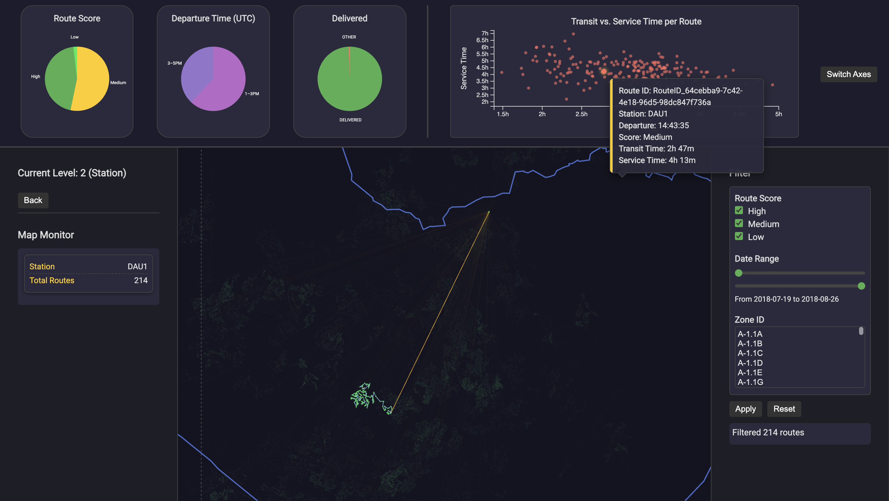

### Amazon Last‑Mile Delivery Dashboard ― README
> *Interactive visual analytics for the 2021 Amazon Last‑Mile Routing Research Challenge*  

---

#### 📍 Live Demo  
The project is hosted online via **GitHub Pages** at  
<https://scou7.github.io/D3-Amazon-delivery-dashboard/>

#### 🎯 What is this?  
This repository contains an **interactive visualization dashboard** that helps you explore the **2021 Amazon Last‑Mile Routing Research Challenge Data Set**.

* **Pure front‑end stack:** `HTML + CSS + JavaScript (ES Modules) + D3 v7`  
* **No back‑end:** the entire ~2.62 GB data set (6 112 routes) is committed to GitHub; a fresh `git clone` completes in under 30 seconds on a fast connection.  
* **Scope of the data:**  
  * 17 Delivery Stations in 4 U.S. metropolitan areas  
  * 6 112 routes • 50 k+ stops • 1 m+ packages  
  * Each route starts at a station, makes an initial **transit** drive to its first drop‑off, then proceeds **stop → stop** while servicing packages.

---

### 🏃‍♀️ Sample User‑Oriented Questions (“Tasks”)
1. **Which routes are scored *Low* and why?**  
2. **At what departure times do *Low‑scoring* routes most often start?**  
3. **Which stations contain the highest share of *undelivered* packages?**

### How the Dashboard Helps   <!-- (revised) -->

* **Route‑Score Filter** – Tick/untick **High / Medium / Low**, press **Apply**.  
  *Every view* (map, scatter, pies) is immediately regenerated from the filtered‐route set, so you can isolate problem‑routes and study their spatial or temporal patterns.

* **Date‑Range Slider** – Narrow the two sliders to focus on a specific window (e.g. a holiday week).  
  The pies summarise only routes inside the chosen dates, and the scatter plot re‑clusters accordingly.

* **Zone‑ID Selector** – Multiselect any delivery zones (Level 2 only).  
  Great for comparing urban vs suburban sub‑areas within the same station.

* **Departure‑Time Pie (Level 2)** – Read‑only but dynamic.  
  It automatically re‑computes for whatever routes survive the filters; hovering a slice reveals exact counts/percentages.

* **Package‑Delivery Pie (Level 3)** – Shows “Delivered” (green) vs “Other” (red/orange) for the currently selected route.  
  The map’s **link colours** (green → yellow → red) visualise traffic slow‑downs, while **node colours** encode average service time at each stop; hover any link or node to see rich stop/segment details.

* **Cross‑Highlighting** – Hover a scatter dot and its route (Level 2) or station (Level 1) lights up on the map, and vice‑versa, helping you correlate spatial and temporal outliers quickly.

---

### 🚀 Suggested Exploration Path
1. **Welcome screen** – press **Discover** once the green pulse appears.  
2. **Nation level (Level 1)**  
   * Three pies summarise *Route Score*, *Departure Time*, and *Delivered vs Other* across the USA.  
   * The scatter plot shows one dot per route (x = *Transit Time*, y = *Service Time*). Hover a dot: the corresponding station on the map lights up.  
3. **Drill to a Station (Level 2)** – click a mint‑green station dot; wait ~1 s for data.  
   * Yellow links = initial **station → first stop** transits.  
   * Blue links = intra‑route stop hops.  
   * The **right‑hand filter panel** is now active – slice by score, date, or delivery zones; all three views update in sync.  
4. **Inspect a Route (Level 3)** – click a route in the scatter plot *or* on the map.  
   * The path is re‑projected; every link is coloured **green → yellow → red** by *traffic ratio* (seconds per km).  
   * **Red segments mean the vehicle moved unusually slowly given the distance – likely congestion or long waits.**  
   * Nodes are shaded by average planned service time; hover to see stop‑level package details.  
5. **Iterate** – use **Back** to climb up the hierarchy and explore further combinations.

---

## 2. Developer & Power‑User Reference  (“The Long Part 📚”)

> Everything below is intentionally exhaustive – treat it as an internal wiki.

### 📂 Repository Layout
```
├── index.html
├── styles.css
└── scripts/
    ├── main.js            # entry; bootstraps preload & UI
    ├── stateManager.js    # single source of truth (currentLevel, filters…)
    ├── dataLoader.js      # lazy & bulk CSV / GeoJSON loading
    ├── mapManager.js      # Level‑specific map rendering, D3‑zoom, gridlines
    ├── scatterPlot.js     # transit‑vs‑service scatter, axis‑switching
    ├── pieCharts.js       # three responsive pies with live tool‑tips
    └── filterManager.js   # sidebar filters, tag summary, re‑render orchestration
```

### 🛠️ Build / Run
No build step is required.  
```bash
git clone https://github.com/scou7/D3-Amazon-delivery-dashboard.git
cd D3-Amazon-delivery-dashboard
python3 -m http.server 8000   # or any static server
# open http://localhost:8000 in a modern browser
```
All scripts use `type="module"` so you must serve files over HTTP (S); direct `file://` will violate CORS.

### ⚖️ Data Pre‑Processing (offline)
* **`processed_data/<STATION>/routes.csv`** – direct subset of the challenge CSV.  
* **`route_time_metrics.csv`** – pre‑computed with Python to avoid 6 k × 50 k inner joins in‑browser:  
  ```sql
  total_service_time_sec = Σ(planned_service_time_seconds) per route
  total_transit_time_sec = Σ(travel_time[i→i+1]) per route
  ```
* **`borders.json`** – TopoJSON converted to GeoJSON (US counties, 1:5 m).  
* **Travel‑time matrices** – one CSV per route, tiny (< 50 kB each).

### 🖼️ Rendering Pipeline
1. **`preloadAllData()`** (async)  
   * Loads *station‑aggregates* for Level 1 and full station blobs for deeper levels.  
   * Attaches metrics to route objects → constant‑time access during interactions.  
2. **`setLevel()`** (finite‑state controller)  
   * Shows / hides filter panel, updates label, and calls the triad:  
     `renderScatterPlot()` • `updatePieCharts()` • `initMap()`.  
3. **Map internals** (`mapManager.js`)  
   * Unified “zoom‑group” pattern; projection chosen by `fitMapTo*()` helpers.  
   * Adaptive **lat/long grid** refreshes in `zoom` event for crisp cartography.  
4. **Interactive co‑brushing**  
   * Hover a scatter dot → station or route emphasised on the map via CSS classes.  
   * Hover a map path → complementary highlight plus info panel (`mapMonitorHover`).  
   * All events are *pure UI*; underlying data arrays remain immutable.

### 🧮 Colour Logic
| Visual            | Scale / Palette | Semantics                                  |
|-------------------|-----------------|--------------------------------------------|
| Route links (L3)  | `trafficColorScale` green → yellow → red | High speed → congestion |
| Stop nodes (L3)   | `serviceColorScale` teal gradient       | Avg. planned service time |
| Scatter dots      | Fixed warm red, opacity 0.6             | One per route             |
| Pies              | Discrete dictionaries (cf. `pieCharts.js`) | Route Score / Delivered status / Departure time |

### 📈 Performance Notes
* **Lazy SVG updates** – pie charts and scatter plot diff data joins, not full re‑draws.  
* **Map paths** – only segments *in view* (station / route) are inserted into DOM.  
* **D3 zoom** scale extent `[0.1, 30]`; grid line generation tuned to avoid thousands of paths.

### 🔑 Key Design Decisions
* **Single‑page, no frameworks** – reduces bundle size and keeps the learning curve low.  
* **ES Modules** – explicit dependencies, effortless tree‑shaking if you ever bundle.  
* **Minimal CSS variables** – dark palette centralised in `:root`, easy theming.  
* **Three‑level hierarchy** – mirrors the mental model Delivery Station → Route → Stop.

### 🛡️ Limitations & Future Work
* Browser RAM must hold ~100 MB once Level 3 is loaded for the largest routes.  
* Travel‑time matrices are fetched on‑demand; a background *IndexedDB* cache could eliminate re‑downloads.  
* Package‑level **actual scan timestamps** (not in the public data) would unlock delay root‑cause analysis.

---

#### © 2025 Taehwan Park  
Licensed under the MIT License – see `LICENSE`.  

Feel free to open issues or pull requests for improvements!
